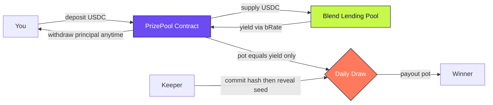
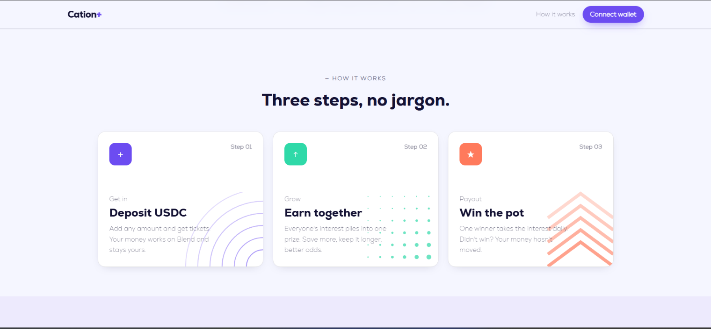
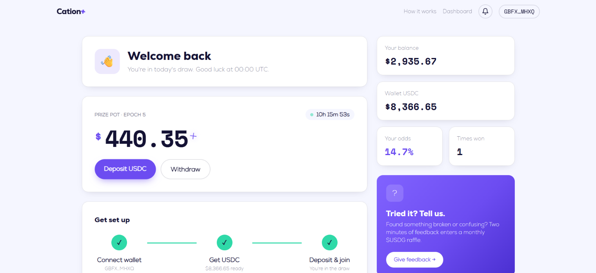

# Cation

**Save money, win the interest, never lose a cent.**

🌐 **[Live demo](https://cation-henna.vercel.app)** &nbsp;·&nbsp; 🎥 **[Demo video](https://youtu.be/vstzwRWsTg0)** &nbsp;·&nbsp; 📝 **[Give feedback](https://docs.google.com/forms/d/e/1FAIpQLSfGVy1i2Nh0uQni2akNtCSQ_gsmgT0oPM9xbidhPcg2ynTiIA/viewform)**

Cation is a no-loss prize-linked savings dApp built on Stellar. Everyone's
USDC is pooled together and supplied to [Blend](https://www.blend.capital/)
to earn yield. Every day at 00:00 UTC, all that accrued yield goes to one
winner through a provably fair draw. If you don't win, your money is still
there in full, and you can pull it out whenever you want.

Think of it like a savings account where the bank's interest rate becomes a
daily lottery. But unlike a lottery, nobody ever loses their deposit.
## Analytics (Vercel)


## How it works

The whole system follows a simple loop:

1. **You deposit USDC.** Your tokens are pulled into the PrizePool contract
   and immediately supplied to a Blend lending pool. Blend is a decentralized
   lending protocol on Stellar. Your USDC starts earning interest right away.

2. **Interest accrues.** While your USDC sits in Blend, the exchange rate
   (bRate) slowly rises. That means the pool's total value grows over time,
   even though nobody added more money. The growth is pure yield from lending.

3. **A daily draw picks a winner.** Every day at 00:00 UTC, the keeper runs a
   two-step commit-reveal process. First it commits a hashed secret, then
   after a few ledgers it reveals the seed. The contract mixes the seed with
   on-chain entropy (ledger number and timestamp) to pick one saver at random,
   weighted by their tickets.

4. **The winner gets the yield, not the principal.** The draw redeems only the
   accrued interest from Blend. The winner's wallet receives the pot. Everyone
   else keeps every cent of their deposit.

5. **You can withdraw anytime.** At any point you can pull your full principal
   back. The contract redeems exactly your share from Blend and sends you USDC.
   There is no lock-in unless you chose one.

## System overview

Everything centers on one contract. Your money goes to Blend to earn yield,
the contract tracks who should get how many chances, and a scheduled keeper
triggers the fair draw. Principal and yield are always kept separate.



In plain words:

* You interact only with the PrizePool. You never touch Blend directly.
* The PrizePool is the only address that supplies to Blend. Your USDC is
  pooled there, so `pot = Blend value minus total principal`.
* The Keeper does not control who wins. It only triggers the draw. The
  randomness is mixed with ledger data on chain, and the winner is picked
  proportional to tickets.
* If you do not win, nothing moves. If you do win, only the pot moves.
  Your principal stays exactly where it was.

```
You -> deposit 100 USDC -> PrizePool -> supply 100 to Blend
                          PrizePool holds ticket: 100 x ledgers held
Blend -> bRate rises -> PrizePool now worth 100.40 -> pot = 0.40
Keeper -> commit hash -> wait -> reveal seed -> draw -> Winner gets 0.40
You -> withdraw 100 USDC -> PrizePool -> redeem 100 from Blend -> you get 100
```

## The pot and odds

The "pot" is the difference between the current Blend value of the pool and
the total principal held by all savers. If the pool holds $10,000 in Blend
but savers deposited $9,950, the pot is $50. That $50 is the yield available
for the next draw.

Your odds of winning are proportional to your share of total tickets. The
formula is simple:

```
your tickets = your deposit x number of ledgers you've held it
your odds = your tickets / total tickets across all savers
```

This means two things matter: how much you deposit and how long you keep it
there. A bigger deposit earns more tickets, but so does holding for longer.
Someone who deposited $100 a month ago has more tickets than someone who
just deposited $100 today. This rewards loyalty, not last-minute deposits.

When you top up an existing deposit, the contract recalculates your holding
start as a weighted average. This prevents someone from gaming the system by
adding small amounts right before a draw to inflate their ticket count.

## Fairness and draw mechanism

The draw uses a commit-reveal scheme to ensure the keeper cannot manipulate
the outcome:

1. **Commit phase:** The keeper submits `sha256(seed)` on-chain before the
   draw window opens. At this point the seed is hidden, so the keeper is
   committed to a specific value.

2. **Reveal phase:** After the draw window opens, the keeper reveals the raw
   seed. The contract verifies that `sha256(seed)` matches the committed
   hash. If it doesn't, the reveal is rejected.

3. **Entropy mixing:** The revealed seed is mixed with the current ledger
   sequence number and timestamp using SHA-256. This adds on-chain entropy
   that the keeper couldn't have predicted at commit time.

4. **Weighted selection:** The resulting random number is reduced to a u64
   and used to pick a winner proportional to ticket weights. The reveal redeems
   only the pot (the yield) out of Blend and records the winner; principal is
   never touched.

5. **Payout:** A separate `claim_prize` call pays the recorded winner. It is
   permissionless and can only pay the winner the draw picked. See "Why the draw
   pays in two steps" below for why the transfer is split out.

The draw also publishes an on-chain event with the winner, amount, and epoch
number. You can verify the result yourself on Stellar Expert.

### Early exit and penalties

Cation lets you lock your deposit for 3 to 90 days. While locked, you cannot
withdraw (the contract enforces this on-chain, not through app rules). If you
really need to pull your money out early, you can, but you pay a penalty of
5% (configurable in basis points). That penalty stays in the pool and flows
into the prize pot, so other savers benefit from your early exit.

## Tech stack

### Smart contract (Soroban, Rust)

The core is a Soroban smart contract written in Rust. It handles:

- Deposit and withdrawal with Blend supply/redeem
- Time-weighted ticket accounting
- On-chain lock enforcement with early exit penalties
- Commit-reveal draw with entropy mixing, and a separate `claim_prize` payout
- Event emission for history and notifications

The contract compiles to WebAssembly and is deployed on Stellar testnet.
See `docs/BUILD.md` for toolchain details.

### Blend integration

[Blend](https://www.blend.capital/) is the yield source. The contract
supplies USDC into a conservative fixed-USDC lending pool and earns interest
as bTokens appreciate. The contract is a supplier only, meaning it never
provides liquidity to AMMs or takes on exotic collateral. This keeps
principal safe.

We use Circle's official testnet USDC. Because the stock Blend testnet pools
were not activated for it, we deployed our own Blend pool (via the factory)
with Circle USDC as an active reserve, so deposits supply real Blend yield.
Grab test USDC from https://faucet.circle.com/ .

### Frontend (Next.js, React, Tailwind)

The web app is built with Next.js 16 (App Router), React 19, and Tailwind
CSS 4. Key features:

- **Landing page** with an interactive wave background (React Three Fiber)
- **Pool app** at `/app` showing pot, countdown, balance, odds, and
  deposit/withdraw forms
- **Draw history** at `/app/history` reading on-chain events via RPC
- **Win reveal** scratch-card animation when you win
- **Notification bell** polling for new draw results
- **Mobile responsive** down to 375px width
- **Loading skeletons** and toast notifications for better UX

### Wallet connection

Cation uses [Stellar Wallets Kit](https://github.com/Creit-Tech/stellar-wallets-kit)
to support Freighter, xBull, Lobstr, Albedo, and Hana. The wallet picker
modal is styled to match the Cation design system (violet primary, cloud
background, chunky rounded cards).

### Keeper

The keeper is a Node.js script (`keeper/draw.mjs`) that runs the daily
draw automatically. It is triggered via GitHub Actions on a cron at 00:00 UTC.
The keeper no-ops until the draw window is open, so frequent runs are safe.

See `keeper/README.md` for setup and scheduling.

## Project structure

```
contracts/prize-pool/     Soroban smart contract (Rust)
  src/lib.rs              Core logic: deposit, withdraw, draw, tickets
  src/blend.rs            Blend pool interface (supply, redeem, value)
  src/types.rs            Data types and error definitions
  src/test.rs             Native unit tests (6 green)
  wasm/blend_pool.wasm    Blend pool ABI for contractimport

web/                      Next.js frontend
  app/page.tsx            Landing page
  app/app/page.tsx        Pool home (pot, balance, deposit, withdraw)
  app/app/history/        Draw history
  app/how-it-works/       How it works explainer
  components/             React components (Navbar, Footer, forms, etc.)
  lib/client/wallet.ts    Wallet connection and signing
  lib/server/             Server-side contract reads
  lib/config.ts           Network and contract addresses

keeper/                   Daily draw automation
  draw.mjs                Commit-reveal draw script

docs/                     Documentation
  BUILD.md                How to build and deploy the contract
  TESTNET.md              Testnet deployment details and validation

config/                   Environment config
  testnet.env             Testnet addresses and parameters

.github/workflows/        CI/CD (see below)
  ci.yml                  Contract + web build/test/lint on every push
  deploy.yml              Manual deploy to testnet + Vercel
  draw.yml                Scheduled draw keeper
```

## Continuous integration and deployment

GitHub Actions workflows live in `.github/workflows/`:

- **`ci.yml`** runs on every push and pull request, with two jobs:
  - *smart contract*: `cargo fmt --check`, `cargo clippy`, `cargo test` (7
    tests), plus a wasm build via `stellar contract build`.
  - *frontend*: `npm install`, `npm run lint`, and `npm run build`.
- **`deploy.yml`** is a manual (`workflow_dispatch`) CD pipeline that can deploy
  the contract to Stellar testnet (`stellar contract deploy`) and/or the web app
  to Vercel. Both are gated on repository secrets, so a deploy is always
  deliberate and never runs on its own.
- **`draw.yml`** runs the draw keeper on a schedule (see Keeper above).

### Note on the Level 4 review

An earlier submission was returned for revisions: the repo only had the keeper
workflow, with no CI to build or test the contract and app and no deployment
job. This was addressed by adding `ci.yml` (contract fmt/clippy/test/build and
web install/lint/build) and `deploy.yml` (manual contract + web deploy). The
contract was also run through `cargo fmt`, and the ESLint config was tightened
to ignore generated bindings while keeping the lint gate meaningful.

### UI revamp (post-review)

The "work more on UI" feedback drove a frontend redesign:

- **Typography** — self-hosted Nexa (Heavy for display, ExtraLight for body)
  via `next/font/local`; Space Mono kept for figures.
- **Landing** — left-aligned hero over a `bg.png` violet artwork with a
  hand/phone mockup that rotates in on load; scroll-reveal throughout.
- **Feature cards** — reference-style cards (accent icon, tag, title, and a
  decorative SVG motif per card in `CardDecor`) replacing the old grid.
- **Dashboard** — reworked into a two-column layout: welcome, live pot,
  a progress stepper, action tiles, animated stat tiles, and a help card.
- **Housekeeping** — dropped the three.js wave background (and its deps) for
  a lighter CSS/asset hero.

#### Screenshots






## Testnet deployment

The contract is live on Stellar testnet (Circle USDC, active Blend pool):

- **PrizePool:** `CA2R26QQEXNMQ6CXFINDKPKTEDUWV6E3OWSHPMEO62PSNOYR2QZ4QILW`
- **USDC:** `CBIELTK6YBZJU5UP2WWQEUCYKLPU6AUNZ2BQ4WWFEIE3USCIHMXQDAMA` (Circle `USDC:GBBD47IF6LWK7P7MDEVSCWR7DPUWV3NY3DTQEVFL4NAT4AQH3ZLLFLA5`)
- **Blend pool (CationCircle, status active):** `CDCCWAQCFXSJOWTYQRI4NPBVGC3NQDR3626MLOEAWLHXUECCASSW5ZPX`
- **Draw interval:** 17,280 ledgers (~1 day), drawn at 00:00 UTC
- **Early exit penalty:** 500 bps (5%)

Config lives in `config/testnet.env`. Deploy scripts are in
`scripts/deploy-testnet.sh`.

Claim test USDC at https://faucet.circle.com/ , then add trustline `USDC:GBBD47IF6LWK7P7MDEVSCWR7DPUWV3NY3DTQEVFL4NAT4AQH3ZLLFLA5`.

You can verify the contract on
[Stellar Expert](https://stellar.expert/explorer/testnet/contract/CA2R26QQEXNMQ6CXFINDKPKTEDUWV6E3OWSHPMEO62PSNOYR2QZ4QILW).

## Getting started

### Prerequisites

- Rust 1.97+ with `wasm32v1-none` target
- Stellar CLI 25+
- Node.js 22+
- A Stellar wallet (Freighter recommended)

### Build the contract

```bash
# Run tests
cargo test -p prize-pool

# Build wasm
cargo rustc -p prize-pool --release --target wasm32v1-none --crate-type cdylib

# Optimize for deploy
stellar contract optimize --wasm target/wasm32v1-none/release/prize_pool.wasm
```

### Run the frontend

```bash
cd web
npm install
npm run dev
```

No env vars are required on testnet (addresses and Circle's USDC issuer are
baked into `lib/config.ts`; see `.env.example` for optional overrides).

The landing page is at `http://localhost:3000` and the pool app is at `/app`.
Connect your wallet, claim test USDC at https://faucet.circle.com/ and add
the Circle USDC trustline (the "Get test USDC" button sets it up), then
deposit.

### Run the keeper

```bash
cd keeper
npm install
POOL_ID=<contract-address> KEEPER_SECRET=<admin-secret> npm run draw
```

The keeper checks if the draw window is open and runs the commit-reveal
flow if it is. Otherwise it prints how many ledgers remain and exits.

## Security invariants

The contract maintains three core invariants:

1. **Payout never exceeds the pot.** The draw can only redeem the accrued
   yield, never the principal. Your deposit is safe.

2. **Total principal matches the sum of all user balances.** Every USDC
   accounted for belongs to someone.

3. **Non-winners can always withdraw.** Unless you explicitly locked your
   deposit, your full principal is always redeemable from Blend.

## Why the draw pays in two steps

`reveal_draw` picks the winner from execution-time ledger entropy, so the keeper
cannot grind the seed to steer the result. That also means the winner is unknown
when the reveal is simulated, and on Soroban a transaction can only touch ledger
entries in its declared footprint, so the reveal itself cannot pay a winner it
does not yet know.

So the payout is a separate call:

1. **`reveal_draw`** picks the winner, redeems the pot out of Blend into the
   contract, and records the prize (`winner`, `amount`, `epoch`). No transfer,
   so nothing depends on knowing the winner ahead of time.
2. **`claim_prize`** pays the recorded winner. It is permissionless (the keeper
   calls it right after the reveal, but anyone can), and the funds only ever go
   to the winner the draw picked. Because the winner is now fixed in storage, it
   is in this transaction's footprint and the transfer succeeds.

Principal and pot are never at risk between the two steps: the pot is already
redeemed and earmarked for the winner. This also keeps the keeper off the payout
path — it can trigger the claim but cannot change who gets paid.

## Roadmap

Cation works today on testnet. The plan from here keeps one thing fixed: your
principal is never at risk, and prizes only ever come from yield. Everything
below builds on that promise instead of bending it.

### Phase 1 — Trustworthy by default (next)
The clearest signal from our first testers was trust, not features. So this
phase is about proof.
- Independent smart-contract audit before any mainnet funds.
- A "where your money goes and what can go wrong" panel right inside the
  deposit flow, plus an odds tooltip that explains the time-weighted tickets.
- Verifiable randomness (on-chain VRF) for the draw, replacing the
  commit-reveal scheme we use on testnet.
- A real brand identity: a proper logo, a custom illustration and motion
  style, and a design system that makes Cation instantly recognizable instead
  of looking like a template. Trust starts with looking like you are here to
  stay.

### Phase 2 — Mainnet launch
- Go live on Stellar mainnet with Circle USDC and a vetted Blend pool.
- Introduce a small protocol fee taken only from the generated yield, never
  from anyone's deposit. This is how Cation sustains itself: we earn a sliver
  of the interest, savers keep every cent of principal, and one of them wins
  the rest each day.
- Public dashboard for total value saved, yield generated, and prizes paid.

### Phase 3 — More ways to save and win
- Multiple pools: different assets and different draw cadences (daily, weekly,
  jackpot rounds) so savers pick their own risk and rhythm.
- Loyalty boosts for longer locks, and a referral program that shares a cut of
  the protocol fee, not your principal.
- Sponsored prize pools: partners and brands top up the pot, so prizes can grow
  faster than yield alone.

### Phase 4 — Open and everywhere
- Move draw parameters and treasury decisions to community governance.
- Reach savers beyond Stellar. We already collect rewards on EVM networks, so
  cross-chain deposits and payouts are a natural next step.
- Open the pool API so other apps can offer "save and win" on top of Cation.

## License

See `LICENSE` for details.
