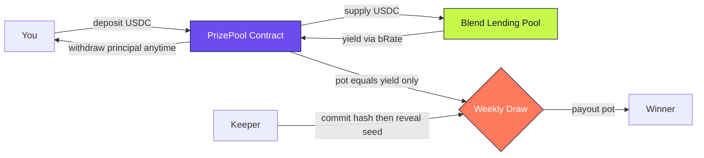

# Cation

**Save money, win the interest, never lose a cent.**

Cation is a no-loss prize-linked savings dApp built on Stellar. Everyone's
USDC is pooled together and supplied to [Blend](https://www.blend.capital/)
to earn yield. Once a week, all that accrued yield goes to one winner through
a provably fair draw. If you don't win, your money is still there in full,
and you can pull it out whenever you want.

Think of it like a savings account where the bank's interest rate becomes a
weekly lottery. But unlike a lottery, nobody ever loses their deposit.

## How it works

The whole system follows a simple loop:

1. **You deposit USDC.** Your tokens are pulled into the PrizePool contract
   and immediately supplied to a Blend lending pool. Blend is a decentralized
   lending protocol on Stellar. Your USDC starts earning interest right away.

2. **Interest accrues.** While your USDC sits in Blend, the exchange rate
   (bRate) slowly rises. That means the pool's total value grows over time,
   even though nobody added more money. The growth is pure yield from lending.

3. **A weekly draw picks a winner.** Once a week, the keeper contract runs a
   two-step commit-reveal process. First it commits a hashed secret, then
   after a few ledgers it reveals the seed. The contract mixes the seed with
   on-chain entropy (ledger number and timestamp) to pick one saver at random,
   weighted by their tickets.

4. **The winner gets the yield, not the principal.** The draw redeems only the
   accrued interest from Blend. The winner's wallet receives the pot. Everyone
   else keeps every cent of their deposit.

5. **You can withdraw anytime.** At any point you can pull your full principal
   back. The contract redeems exactly your share from Blend and sends you USDC.
   There is no lock-in unless you chose one.

## System overview

Everything centers on one contract. Your money goes to Blend to earn yield,
the contract tracks who should get how many chances, and a scheduled keeper
triggers the fair draw. Principal and yield are always kept separate.



In plain words:

* You interact only with the PrizePool. You never touch Blend directly.
* The PrizePool is the only address that supplies to Blend. Your USDC is
  pooled there, so `pot = Blend value minus total principal`.
* The Keeper does not control who wins. It only triggers the draw. The
  randomness is mixed with ledger data on chain, and the winner is picked
  proportional to tickets.
* If you do not win, nothing moves. If you do win, only the pot moves.
  Your principal stays exactly where it was.

```
You -> deposit 100 USDC -> PrizePool -> supply 100 to Blend
                          PrizePool holds ticket: 100 x ledgers held
Blend -> bRate rises -> PrizePool now worth 100.40 -> pot = 0.40
Keeper -> commit hash -> wait -> reveal seed -> draw -> Winner gets 0.40
You -> withdraw 100 USDC -> PrizePool -> redeem 100 from Blend -> you get 100
```

## The pot and odds

The "pot" is the difference between the current Blend value of the pool and
the total principal held by all savers. If the pool holds $10,000 in Blend
but savers deposited $9,950, the pot is $50. That $50 is the yield available
for the next draw.

Your odds of winning are proportional to your share of total tickets. The
formula is simple:

```
your tickets = your deposit x number of ledgers you've held it
your odds = your tickets / total tickets across all savers
```

This means two things matter: how much you deposit and how long you keep it
there. A bigger deposit earns more tickets, but so does holding for longer.
Someone who deposited $100 a month ago has more tickets than someone who
just deposited $100 today. This rewards loyalty, not last-minute deposits.

When you top up an existing deposit, the contract recalculates your holding
start as a weighted average. This prevents someone from gaming the system by
adding small amounts right before a draw to inflate their ticket count.

## Fairness and draw mechanism

The draw uses a commit-reveal scheme to ensure the keeper cannot manipulate
the outcome:

1. **Commit phase:** The keeper submits `sha256(seed)` on-chain before the
   draw window opens. At this point the seed is hidden, so the keeper is
   committed to a specific value.

2. **Reveal phase:** After the draw window opens, the keeper reveals the raw
   seed. The contract verifies that `sha256(seed)` matches the committed
   hash. If it doesn't, the reveal is rejected.

3. **Entropy mixing:** The revealed seed is mixed with the current ledger
   sequence number and timestamp using SHA-256. This adds on-chain entropy
   that the keeper couldn't have predicted at commit time.

4. **Weighted selection:** The resulting random number is reduced to a u64
   and used to pick a winner proportional to ticket weights. The winner
   receives only the pot amount (the yield). Principal is never touched.

The draw also publishes an on-chain event with the winner, amount, and epoch
number. You can verify the result yourself on Stellar Expert.

### Early exit and penalties

Cation lets you lock your deposit for 3 to 90 days. While locked, you cannot
withdraw (the contract enforces this on-chain, not through app rules). If you
really need to pull your money out early, you can, but you pay a penalty of
5% (configurable in basis points). That penalty stays in the pool and flows
into the prize pot, so other savers benefit from your early exit.

## Tech stack

### Smart contract (Soroban, Rust)

The core is a Soroban smart contract written in Rust. It handles:

- Deposit and withdrawal with Blend supply/redeem
- Time-weighted ticket accounting
- On-chain lock enforcement with early exit penalties
- Commit-reveal draw with entropy mixing
- Event emission for history and notifications

The contract compiles to WebAssembly and is deployed on Stellar testnet.
See `docs/BUILD.md` for toolchain details.

### Blend integration

[Blend](https://www.blend.capital/) is the yield source. The contract
supplies USDC into a conservative fixed-USDC lending pool and earns interest
as bTokens appreciate. The contract is a supplier only, meaning it never
provides liquidity to AMMs or takes on exotic collateral. This keeps
principal safe.

We run our own Blend stack on testnet so USDC is mintable for onboarding
users. The official testnet USDC has an issuer-gated supply, so we deployed
a parallel pool with our own USDC contract.

### Frontend (Next.js, React, Tailwind)

The web app is built with Next.js 16 (App Router), React 19, and Tailwind
CSS 4. Key features:

- **Landing page** with an interactive wave background (React Three Fiber)
- **Pool app** at `/app` showing pot, countdown, balance, odds, and
  deposit/withdraw forms
- **Draw history** at `/app/history` reading on-chain events via RPC
- **Win reveal** scratch-card animation when you win
- **Notification bell** polling for new draw results
- **Mobile responsive** down to 375px width
- **Loading skeletons** and toast notifications for better UX

### Wallet connection

Cation uses [Stellar Wallets Kit](https://github.com/Creit-Tech/stellar-wallets-kit)
to support Freighter, xBull, Lobstr, Albedo, and Hana. The wallet picker
modal is styled to match the Cation design system (violet primary, cloud
background, chunky rounded cards).

### Keeper

The keeper is a Node.js script (`keeper/draw.mjs`) that runs the weekly
draw automatically. It can be triggered via GitHub Actions on a daily cron.
The keeper no-ops until the draw window is open, so frequent runs are safe.

See `keeper/README.md` for setup and scheduling.

## Project structure

```
contracts/prize-pool/     Soroban smart contract (Rust)
  src/lib.rs              Core logic: deposit, withdraw, draw, tickets
  src/blend.rs            Blend pool interface (supply, redeem, value)
  src/types.rs            Data types and error definitions
  src/test.rs             Native unit tests (6 green)
  wasm/blend_pool.wasm    Blend pool ABI for contractimport

web/                      Next.js frontend
  app/page.tsx            Landing page
  app/app/page.tsx        Pool home (pot, balance, deposit, withdraw)
  app/app/history/        Draw history
  app/how-it-works/       How it works explainer
  components/             React components (Navbar, Footer, forms, etc.)
  lib/client/wallet.ts    Wallet connection and signing
  lib/server/             Server-side contract reads
  lib/config.ts           Network and contract addresses

keeper/                   Weekly draw automation
  draw.mjs                Commit-reveal draw script

docs/                     Documentation
  BUILD.md                How to build and deploy the contract
  TESTNET.md              Testnet deployment details and validation

config/                   Environment config
  testnet.env             Testnet addresses and parameters
```

## Testnet deployment

The contract is live on Stellar testnet:

- **PrizePool:** `CC5JEG6QSEETBZKPSUIWEGSPOT63Z7QVBVP4CXGH2MXB5O5CBV323IZ6`
- **USDC:** `CBIELTK6YBZJU5UP2WWQEUCYKLPU6AUNZ2BQ4WWFEIE3USCIHMXQDAMA` (Circle `USDC:GBBD47IF6LWK7P7MDEVSCWR7DPUWV3NY3DTQEVFL4NAT4AQH3ZLLFLA5`)
- **Blend pool:** `CAYFESJVBO2OLTRYGYDS46MLDKONFYCRSE4HEJ3D75LCIDHF63RA22LY`
- **Draw interval:** 120,960 ledgers (~7 days)
- **Early exit penalty:** 500 bps (5%)

Config lives in `config/testnet.env`. Deploy scripts are in
`scripts/deploy-testnet.sh`.

Claim test USDC at https://faucet.circle.com/ , then add trustline `USDC:GBBD47IF6LWK7P7MDEVSCWR7DPUWV3NY3DTQEVFL4NAT4AQH3ZLLFLA5`.

You can verify the contract on
[Stellar Expert](https://stellar.expert/explorer/testnet/contract/CC5JEG6QSEETBZKPSUIWEGSPOT63Z7QVBVP4CXGH2MXB5O5CBV323IZ6).

## Getting started

### Prerequisites

- Rust 1.97+ with `wasm32v1-none` target
- Stellar CLI 25+
- Node.js 22+
- A Stellar wallet (Freighter recommended)

### Build the contract

```bash
# Run tests
cargo test -p prize-pool

# Build wasm
cargo rustc -p prize-pool --release --target wasm32v1-none --crate-type cdylib

# Optimize for deploy
stellar contract optimize --wasm target/wasm32v1-none/release/prize_pool.wasm
```

### Run the frontend

```bash
cd web
cp .env.example .env.local  # fill in CATION_ADMIN_SECRET and NEXT_PUBLIC_USDC_ISSUER
npm install
npm run dev
```

The landing page is at `http://localhost:3000` and the pool app is at
`/app`. Connect your wallet, grab some test USDC from the faucet, and
you're ready to deposit.

### Run the keeper

```bash
cd keeper
npm install
POOL_ID=<contract-address> KEEPER_SECRET=<admin-secret> npm run draw
```

The keeper checks if the draw window is open and runs the commit-reveal
flow if it is. Otherwise it prints how many ledgers remain and exits.

## Security invariants

The contract maintains three core invariants:

1. **Payout never exceeds the pot.** The draw can only redeem the accrued
   yield, never the principal. Your deposit is safe.

2. **Total principal matches the sum of all user balances.** Every USDC
   accounted for belongs to someone.

3. **Non-winners can always withdraw.** Unless you explicitly locked your
   deposit, your full principal is always redeemable from Blend.

## License

See `LICENSE` for details.
